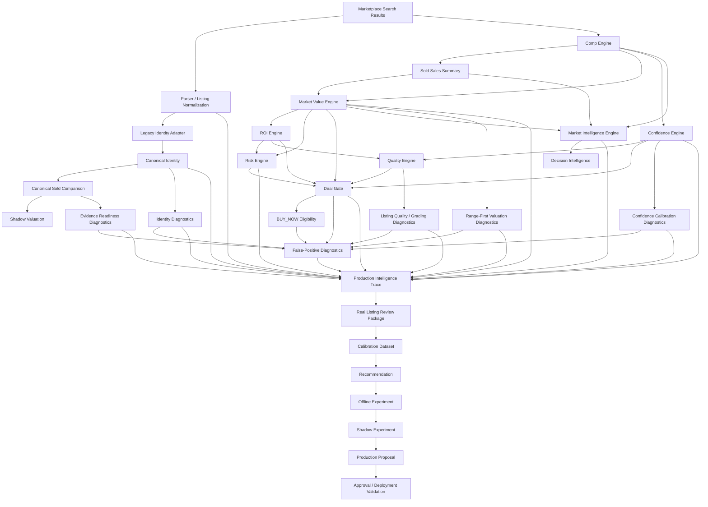

# Phase 13.0B - Intelligence Signal Inventory and Contract Alignment Audit

## Executive Summary

CardHawk already produces a broad intelligence surface across parser, identity, comparable selection, sold evidence, valuation, range interpretation, confidence, risk, quality, grading, ROI, Deal Gate, BUY_NOW, learning, review, and governance systems. The current architecture is modular and mostly deterministic, but signal meaning is not yet normalized across modules.

The highest-value Phase 13 problem remains signal alignment. The repository contains many useful signals, but several concepts are represented in overlapping ways: confidence, evidence sufficiency, valuation support, listing quality, risk, grading safety, recommendation language, and production authority. This does not currently break production behavior because Deal Gate remains the authoritative BUY_NOW boundary. It does, however, make long-term explainability, review, calibration, and governed promotion harder than necessary.

This audit recommends an offline canonical intelligence signal contract as the next implementation phase. The contract should not change scoring, valuation, Deal Gate, BUY_NOW, notifications, scanner behavior, persistence, marketplace behavior, or production authority. It should define stable metadata around existing outputs so future Phase 13 work can align signals without reinterpreting them ad hoc.

## Scope and Authority Boundary

This audit reviewed production and offline signal producers in:

- `server.js`
- `services/scoutScannerService.js`
- `services/soldEvidenceService.js`
- `services/canonicalSoldComparisonService.js`
- `utils/signalContractRegistry.js`
- `utils/signalAnnotation.js`
- `utils/signalSemantics.js`
- `engines/*`
- `engines/intelligence/*`
- `validation/*Diagnostics.js`
- Phase 12 review, calibration, experiment, proposal, approval, deployment, and pipeline governance modules

This document is architecture-only. It does not grant production authority to shadow, diagnostic, review, calibration, experiment, proposal, or governance artifacts.

## Current Signal Authority Classes

| Authority class | Meaning | Current examples | Production authority |
| --- | --- | --- | --- |
| Production decision | The signal can determine production BUY_NOW/PASS behavior. | Deal Gate outcome, BUY_NOW eligibility derived from Deal Gate. | Yes. |
| Production scoring context | The signal contributes to current scoring, valuation, confidence, quality, risk, or ranking. | Comp Engine, Market Value Engine, Confidence Engine, ROI Engine, Quality Engine, Risk Engine, Grading Engine, Market Intelligence Engine. | Context only unless consumed by Deal Gate rules. |
| Shadow observation | The signal compares or diagnoses production behavior without authority. | Shadow sold comparison, Shadow Valuation, Phase 10 diagnostics. | No. |
| Offline validation | The signal evaluates reviewed listings, calibration datasets, experiments, or validation outcomes. | Real Listing Review, Calibration Dataset, Recommendation, Offline Experiment Runner. | No. |
| Governance artifact | The signal documents evidence, approval, deployment readiness, or pipeline integrity. | Production Proposal, Approval Artifact, Deployment Validation Artifact, Governance Pipeline Validator. | No automatic authority. |

## Complete Signal Inventory

| Originating engine or module | Signal name | Purpose | Evidence source and inputs | Output fields | Confidence information | Deterministic | Mode and authority | Downstream consumers | Strengths | Weaknesses, duplication, and missing metadata | Governance implications |
| --- | --- | --- | --- | --- | --- | --- | --- | --- | --- | --- | --- |
| Marketplace adapters and scanner | Scan metadata | Captures scan source, lane, query, timing, counts, rate-limit state, and status. | Marketplace search results, scan lifecycle state. | `scan.id`, `source`, `startedAt`, `finishedAt`, `lanes`, `listingsFound`, `newAlerts`, `status`, `rateLimited`, `history`. | None. | Mostly deterministic except timestamps and marketplace input. | Production runtime context. | Production traces, history, system health, review packages. | Clear lifecycle and overlap guard. | Not expressed as a canonical intelligence signal. | Should remain provenance evidence only. |
| Parser / title normalization | Legacy parsed identity | Extracts player, year, brand, set, card number, grade, flags, and quality tier from active listing text. | Listing title and marketplace metadata. | Parsed fields and flags such as rookie, autograph, graded, numbered, lot, reprint, custom, digital, sealed. | Implicit via quality tier and warnings, not a normalized confidence object. | Deterministic for the same title and parser code. | Production scoring input. | Score Listing, identity adapter, quality, risk, grading, review snapshots. | Widely consumed and stable. | Parser certainty, inferred fields, and unsupported fields are not emitted in one canonical signal shape. | Parser changes should flow through review and governance before production promotion. |
| `engines/legacyIdentityAdapter.js` | Legacy-to-canonical identity diagnostics | Bridges legacy parser output into canonical identity input and reports discrepancies. | Parsed identity, canonical identity generation. | Canonical input, canonical identity, comparison, discrepancies, warnings, fingerprints through diagnostics. | Identity confidence exists in canonical metadata but is not standardized with other confidence types. | Deterministic. | Production/shadow support, advisory. | `scoreListing`, shadow sold comparison, shadow valuation, identity diagnostics. | Reduces duplicate identity conversion and enables canonical comparison. | Identity confidence, parser confidence, and comparable identity confidence are related but not normalized. | Should remain evidence until governed parser or identity changes are proposed. |
| `engines/canonicalIdentityEngine.js` | Canonical identity summary | Produces canonical identity keys, normalized fields, eligibility, unknown fields, and warnings. | Structured card identity fields. | `identityKey`, `canonicalCardKey`, normalized identity, eligibility, metadata, warnings. | Identity confidence in metadata. | Deterministic. | Production/shadow/offline identity evidence. | Canonical sold comparison, diagnostics, review packages, dataset tooling. | Strong canonical foundation. | Production scoring still also relies on legacy parsed fields. | Canonical authority must remain bounded by exact identity and evidence rules. |
| `validation/identityParserDiagnostics.js` | Identity parser diagnostic | Classifies parser/canonical mismatch risk. | Listing, parser output, canonical identity, legacy adapter comparison. | `diagnosticStatus`, `ambiguityLevel`, `identityEligibility`, confirmed/missing/conflicting/inferred fields, warnings, blockers, fingerprint. | Diagnostic status and ambiguity level, not numeric confidence. | Deterministic. | Offline/shadow diagnostic. | Production Intelligence Trace, review packages, false-positive diagnostics. | Good field-level explainability. | Similar concepts overlap with canonical identity eligibility and listing similarity. | Must not become a production blocker without governance. |
| `engines/listingSimilarityEngine.js` | Listing similarity | Scores similarity between listing and comparable candidates. | Parsed/canonical identity fields and comparable listing data. | Similarity score, match details, warnings, similarity summaries. | Similarity score acts like identity/evidence confidence but is not labeled as such. | Deterministic. | Production/shadow support. | Comparable selection, decision intelligence, review diagnostics. | Important for comp quality and identity matching. | Similarity, exactness, and identity confidence need clearer separation. | Future changes can materially affect valuation and require governance. |
| `engines/compEngine.js` | Comparable evaluation | Selects and weights comparable listings, rejects mismatches, computes comp market value. | Resident listing universe, candidate listing, fallback estimator. | `compCount`, `trueSoldCompCount`, `activeCompCount`, `marketValue`, `confidence`, selected/rejected/outlier/capped comps, `compCandidateDiagnostics`, warnings, positives. | Numeric `confidence`; comp quality also appears elsewhere. | Deterministic for the same universe and date-sensitive fields. | Production scoring context; Deal Gate consumes sold support and confidence signals. | Market Value, Confidence, Risk, Quality, ROI, Deal Gate, review snapshots. | Rich diagnostics around selected, capped, rejected, and ignored comps. | Active, fallback, and true-sold treatment appears in several engines; confidence meaning is not canonical. | Must preserve rule that active listings and fallback values cannot become true sold evidence. |
| `engines/soldSalesEngine.js` | Sold sales summary | Summarizes sold-like records from the comparison universe. | Listing and universe records with sale dates/prices. | Sales array, weighted averages, recency weights, sale counts, confidence-like summary. | Recency and similarity weighting imply support confidence. | Date-sensitive unless `asOf` is fixed. | Production valuation context. | Market Value Engine, Sales Velocity, Market Intelligence. | Provides recency-aware sold context. | True sold eligibility is not expressed through the same contract as canonical sold evidence. | Must not treat active listings as sold evidence. |
| `services/soldEvidenceService.js` | Canonical sold evidence query | Queries governed sold-evidence store by canonical identity. | Canonical sold evidence store and filters. | Matching records, weighted average, median, recency, summary fields. | Evidence quality and recency fields. | Deterministic for fixed inputs and `asOf`. | Offline/limited runtime evidence service. | Canonical sold comparison, dataset operations, diagnostics, shadow valuation. | Clean separation from active listings. | Limited by provider permission and dataset depth. | No production market value authority without sufficient canonical sold evidence. |
| `services/canonicalSoldComparisonService.js` | Canonical sold comparison | Classifies sold records as exact, contextual, stale, insufficient, or rejected. | Canonical identity and sold evidence records. | Accepted exact matches, contextual/stale/rejected/insufficient lists, rejection stats, identity mismatch stats, confidence summary. | Average identity confidence and evidence quality scores. | Deterministic. | Shadow/offline evidence. | Shadow sold comparison, Shadow Valuation, review packages, dataset reporting. | Strong separation of exact sold evidence from research-only context. | Confidence summary is shaped differently than production confidence. | Exact matches can support future governed valuation, but do not self-promote. |
| `engines/marketValueEngine.js` | Production market value | Calculates production estimated value from available evidence and fallback behavior. | Listing, active comp data, sold comps, population, trend, fallback estimator. | Market value, expected value/range fields, confidence, source, method, warning/context fields. | Numeric confidence. | Mostly deterministic, date-sensitive through sold recency inputs. | Production valuation context. | ROI, Risk, Market Intelligence, Deal Gate, review packages. | Central production valuation surface. | Point estimate and range support are not normalized into one range-first interpretation. | Must not change formulas without Phase 12 approval chain. |
| `engines/valuationRangeEngine.js` | Valuation range | Provides range-first low/expected/high interpretation and range quality. | Evidence summaries, sold sales, comparable quality, active context. | Range bounds, midpoint/expected value, spread, range quality, confidence, basis, adjustments, warnings. | Numeric confidence and range quality. | Deterministic for fixed inputs. | Production/shadow context, not authoritative alone. | Market Intelligence, Range-First Valuation Diagnostics, review packages. | Better uncertainty representation than point value alone. | Range confidence, market confidence, and evidence readiness are related but separate. | Should inform future proposals, not directly alter production values. |
| `engines/shadowValuationEngine.js` | Shadow valuation | Calculates canonical exact-sold valuation posture when sufficient evidence exists. | Canonical sold evidence and shadow sold comparison. | Shadow valuation, fair market range, confidence, evidence summary, insufficient evidence reason. | Shadow valuation confidence. | Deterministic. | Shadow-only evidence. | Production trace optional summary, review packages, calibration datasets. | Preserves production impact as none. | Needs alignment with production point estimate and range diagnostics. | No authority without shadow experiment and production proposal chain. |
| `validation/evidenceReadinessDiagnostics.js` | Evidence readiness diagnostic | Gives one diagnostic view of whether evidence can support valuation. | Sold evidence, comparable quality, identity exactness, source concentration, exclusions. | `readinessStatus`, `readinessLevel`, eligible/excluded summaries, blockers, warnings, evidence used/excluded, valuation readiness, confidence cap recommendation, fingerprint. | Confidence cap recommendation, readiness level. | Deterministic. | Offline/shadow diagnostic. | Production trace, false-positive diagnostic, review packages. | Explicitly prevents active/fallback evidence from satisfying true-sold minimums. | Overlaps with Evidence Sufficiency, Comparable Quality, and Deal Gate evidence gates. | Good candidate for canonical evidence signal shape. |
| `engines/evidenceSufficiencyEngine.js` | Evidence sufficiency | Scores whether evidence is sufficient for valuation review. | Evidence summary, comparable quality, market data, comp data. | `sufficientForValuation`, `sufficiencyLevel`, `evidenceSufficiencyScore`, checks, blockers, warnings, positives. | Numeric sufficiency score and status. | Deterministic. | Production/shadow context. | Market Intelligence, Evidence Readiness Diagnostics, Decision Intelligence. | Valuable aggregate check. | Its status overlaps with evidence readiness and Deal Gate sold-comp checks. | Should be normalized before becoming promotion evidence. |
| `engines/comparableQualityEngine.js` | Comparable quality | Scores individual and aggregate comparable quality. | Comparable records and market context. | Comparable count, scored comps, average quality score, distribution, sample depth, source diversity, condition match rate, warnings. | Average comparable quality score and quality bands. | Deterministic. | Production/shadow context. | Market Intelligence, Evidence Readiness, Decision Intelligence. | Provides granular comp quality signal. | Quality score is not tied to a shared evidence-quality schema. | Strong source for a canonical evidence-quality contract. |
| `validation/rangeFirstValuationDiagnostics.js` | Range-first valuation diagnostic | Evaluates whether a point estimate is supported by a range-first interpretation. | Point estimate, valuation range, evidence readiness, comparable quality. | Diagnostic status, uncertainty level, point/range assessments, supporting/excluded evidence, blockers, warnings, withheld recommendation, confidence cap, fingerprint. | Uncertainty level and confidence cap recommendation. | Deterministic. | Offline/shadow diagnostic. | Production trace, false-positive diagnostic, review packages. | Strong explanation of valuation uncertainty. | Overlaps with valuation range and market value confidence; lacks shared signal envelope. | Should remain diagnostic until promoted through governance. |
| `engines/confidenceEngine.js` | Production confidence | Scores production market/context confidence. | Listing, comp data, universe, seller/history/price sanity/parser traits. | `confidence`, `source`, `cap`, `avgSimilarity`, `compCount`, reasons. | Numeric production confidence and cap. | Deterministic for fixed inputs. | Production scoring context; Deal Gate may consume confidence. | Score Listing, ROI, Quality, Deal Gate, review packages. | Clear and compact. | Confidence combines evidence, seller, history, and card traits; not separated by evidence basis. | Threshold or formula changes require governance. |
| `validation/confidenceCalibrationDiagnostics.js` | Confidence calibration diagnostic | Measures whether reported confidence is supported by reviewed outcomes and evidence quality. | Reported confidence, evidence readiness, valuation uncertainty, identity diagnostic, comparable quality, calibration reports/outcomes. | Calibration status, support level, observed agreement, outcome metrics, gap, over/underconfidence indicators, blockers, warnings, recommended cap, fingerprint. | Explicit calibration status and support level. | Deterministic. | Offline diagnostic. | Production trace, false-positive diagnostic, calibration workflow. | Preserves missing outcomes as missing. | Uses confidence vocabulary different from production confidence and Market Intelligence confidence. | Critical for future confidence changes, but no direct production authority. |
| `engines/qualityEngine.js` | Listing quality | Scores desirability, liquidity, risk terms, seller context, traits, profit, ROI, confidence, comp depth. | Listing, parsed fields, comp/market/confidence/ROI context. | `investmentQuality`, bucket, quality breakdown, liquidity score, risk score/level, positives, warnings, traits. | Not a confidence signal; consumes confidence. | Deterministic. | Production scoring context and display context. | Score Listing, Risk, Deal Grade, display annotations. | Useful explainable contributions. | Bucket names historically contain buy-like wording and are neutralized for display elsewhere. | Should remain context-only unless explicitly promoted. |
| `engines/riskEngine.js` | Listing and market risk | Scores listing, seller, evidence, valuation, ROI, fallback, suspicious-title, and trend risk. | Listing, ROI, market data, sold sales, comp data, trend, quality. | `riskScore`, `riskLevel`, warnings, positives, reasons, summary. | Risk level, not confidence. | Deterministic. | Production scoring context; Deal Gate may consume risk. | Score Listing, Market Intelligence, diagnostics, review packages. | Strong false-positive guard signal. | Overlaps with listing quality diagnostics and opportunity false-positive diagnostics. | Production rule changes require governance. |
| `validation/listingQualityGradingDiagnostics.js` | Listing quality and grading diagnostic | Diagnoses image/title/lot/reprint/condition/seller/price/history/raw-vs-graded/slab and grade premium uncertainty. | Listing, quality/risk/grading/grade-premium/history/identity inputs. | Listing-quality status, grading status, risk level, blockers, warnings, confirmed/ambiguous/unsupported attributes, grading support, history context, fingerprint. | Risk level and statuses. | Deterministic. | Offline/shadow diagnostic. | Production trace, false-positive diagnostic, review packages. | Consolidates quality and grading risk for review. | Overlaps with Quality, Risk, Grading, Grade Premium. | Should feed review/calibration but not production penalties yet. |
| `engines/gradingEngine.js` | Legacy deal grade | Converts numeric signals into a legacy grade and action label. | Listing, parsed identity, score, profit, ROI, confidence, comps, quality. | Grade, action, grade score, reasons, concerns, contributions. | Consumes confidence, does not emit calibrated confidence. | Deterministic. | Legacy production context; Deal Gate remains authoritative. | Score Listing, display, notification context. | Human-readable summary. | Action labels can sound authoritative despite being legacy context. | Must defer to Deal Gate and display-safe signal semantics. |
| `engines/gradePremiumEngine.js` | Grade premium support | Evaluates whether graded-card premium is evidence-supported. | Listing grade profile and evidence comps. | Grade premium score, justification, risk level, sold support, dimensions, warnings, positives. | Support and risk level. | Deterministic. | Production/shadow support. | Listing quality/grading diagnostics, Market Intelligence. | Important for raw-vs-graded and premium false positives. | Needs normalized relationship to valuation/evidence confidence. | Changes may affect opportunity detection and need governance. |
| `engines/roiEngine.js` | ROI and financial posture | Computes expected sale price, costs, fees, profit, ROI, risk-adjusted profit, and financial recommendation. | Listing cost, market value, configured fee assumptions, profit/ROI targets. | `expectedSalePrice`, `listingCost`, `netProfit`, `roi`, `roiPercent`, `riskAdjustedProfit`, costs, targets, recommendation, reasons. | Consumes market confidence. | Deterministic for fixed inputs/config. | Production financial context; Deal Gate remains authority. | Score Listing, Risk, Deal Gate, review packages. | Clear financial math. | Recommendation can be confused with production BUY_NOW unless annotated. | Must not override evidence safeguards. |
| `engines/decisionEngine.js` | Legacy decision signal | Produces broader decision score/recommendation/evidence/opportunity matrix. | Listing, score, ROI, risk, market, confidence, quality, trend, sold sales, comps. | Decision score, recommendation, evidence and opportunity signals, reasons. | Decision confidence or supporting values. | Deterministic. | Production context, not final authority. | Score Listing, learning, decision validation. | Captures multi-factor reasoning. | Overlaps with Deal Gate, ROI recommendation, Market Intelligence, and investment decision prototype. | Needs authority labeling before future use. |
| `engines/decisionIntelligenceEngine.js` | Decision intelligence | Explanation-only synthesis of evidence, similarity, comparable quality, valuation range, and supply pressure. | Evidence sufficiency, listing similarity, comparable quality, valuation range, supply pressure. | Overall readiness, evidence/comp/valuation/resale postures, supporting/caution/blocker/conflict lists, summary. | Readiness posture, not numeric confidence. | Deterministic. | Shadow/explanation-only. | Market Intelligence, signal annotations, review packages. | Good conflict model seed. | Does not yet align every production/shadow signal. | Strong candidate input to Phase 13 Signal Alignment Layer. |
| `engines/marketIntelligenceEngine.js` | Market intelligence | Composite investability/reliability score from liquidity, demand, velocity, trend, volatility, pricing reliability, comp strength, and depth. | Sold/active counts, market data, ROI, comps, canonical sold evidence, component analyzers. | Intelligence score, trust level, recommendation, confidence score, component scores, evidence summary, comparable quality, evidence sufficiency, valuation range, demand/supply/regime/decision intelligence, warnings/reasons. | Separate `confidenceScore` plus trust level. | Deterministic for fixed inputs. | Production context; display-safe semantics constrain authority. | Score Listing, Deal Gate context, display annotations, review packages. | Rich composite context. | Bundles many sub-signals and duplicates confidence/evidence/recommendation concepts. | Future changes should be evaluated through offline and shadow governance. |
| `engines/demandQualityEngine.js` | Demand quality | Evaluates demand durability, breadth, repeatability, and demand context. | Evidence summary, sold sales, velocity, trend, regime. | Demand quality score/status/dimensions/warnings/summary. | Score and status. | Deterministic. | Production/shadow context. | Market Intelligence. | Adds market demand nuance. | Internal to Market Intelligence; not registered as independent signal. | Should receive contract metadata if exposed downstream. |
| `engines/supplyPressureEngine.js` | Supply pressure | Evaluates active inventory depth, active-to-sold pressure, ask-stack pressure, stale inventory, seller concentration, sell-through pressure, and undercut/resale blocker risk. | Active listings/evidence, true sold count, valuation range, demand/regime/liquidity. | Supply pressure score, undercut risk, resale blocker risk, dimensions, warnings, positives. | Risk/status dimensions. | Deterministic. | Production/shadow context. | Market Intelligence, Decision Intelligence. | Important false-positive and resale signal. | Overlaps with risk and listing quality warnings. | Should be evidence-only unless promoted. |
| `engines/marketRegimeEngine.js` | Market regime | Classifies price direction, sales momentum, liquidity state, volatility, supply pressure, evidence depth, hype/stale risk. | Evidence summary, trend, velocity, supply, valuation. | Market regimes, regime score, confidence, dimensions, warnings. | Confidence and dimensions. | Deterministic. | Production/shadow context. | Market Intelligence. | Useful context for changing markets. | Not integrated into canonical signal registry. | Future authority must remain governance-bound. |
| `engines/salesVelocityEngine.js` | Sales velocity | Estimates velocity, liquidity rating, demand strength, days-to-sell, and trend context. | Listing, sold sales, comp data, market data, active count, `asOfDate`. | Velocity score, liquidity rating, demand strength, expected days-to-sell, warnings/summary. | Confidence-like velocity/liquidity values. | Date-sensitive. | Production context. | Score Listing, Market Intelligence, Learning, Prediction Accuracy. | Gives exit-speed context. | Temporal basis and confidence semantics need standardized `asOf`. | Changes may affect opportunity prioritization. |
| `engines/trendEngine.js` | Trend | Evaluates price movement and trend bonus. | Listing and historical/context points. | Trend direction, score, bonus, confidence, summary. | Confidence/score. | Date-sensitive and cache-backed. | Production context. | Score Listing, Risk, Market Intelligence. | Existing signal for market direction. | Cache and as-of semantics are not exposed in a canonical signal envelope. | Future changes need validation because trend influences scores. |
| `engines/populationEngine.js` | Population and scarcity | Evaluates population scarcity, gem rate, higher-grade availability, and scarcity confidence. | Listing/canonical/population context if supplied. | Population summary, scarcity metrics, warnings/summary. | Scarcity confidence. | Deterministic for fixed inputs. | Production context. | Market Value, Score Listing display/context. | Useful graded-card context. | Limited by available population data and source provenance. | Should not imply sold evidence. |
| `engines/historyEngine.js` | Listing history | Tracks active listing observations, price drops, disappeared listings, archive metadata, and history summaries. | Observed listings from scans. | Per-listing history, price history, status, scan metadata, active/archive stats. | None directly. | Date-sensitive. | Production persistence/context. | Learning outcomes, decision/prediction outcomes, UI/API history, review context. | Now bounded and archived. | Historical events are not represented as canonical signals with lifecycle metadata. | History-derived outcomes must remain evidence until reviewed or validated. |
| `engines/learningEngine.js` | Learning snapshots | Records production predictions and outcomes for later learning/reporting. | Saved listings, scoring outputs, decision data, Deal Gate, market/ROI/risk/quality/trend. | Retained records, prediction snapshots, event history, outcome history, summaries. | Stores confidence and later outcome agreement. | Date-sensitive but deterministic for fixed inputs. | Offline/production telemetry, non-authoritative. | Calibration reports, review, future training/evaluation. | Bounded retention and compact snapshots. | Not a production decision engine. | Future model changes must pass governance. |
| `engines/predictionAccuracyEngine.js` | Prediction accuracy | Tracks prediction records and outcomes, derived accuracy, buckets, summaries. | Production decisions and later outcomes. | Predictions, outcomes, latest outcome, derived metrics, confidence calibration summaries. | Confidence buckets and accuracy summaries. | Deterministic for fixed inputs. | Offline validation telemetry. | Calibration Report, review/calibration pipeline. | Good source of reviewed performance evidence once outcomes are available. | Outcome availability may be sparse or delayed. | Evidence-only until promoted through Phase 12. |
| `engines/decisionValidationEngine.js` | Decision validation | Records decisions and outcomes for validation of BUY_NOW/PASS quality. | Production decisions, expected values, ROI/profit, outcomes. | Decision records, snapshots, outcomes, derived metrics, summaries. | Decision confidence fields from production inputs. | Deterministic for fixed inputs. | Offline validation telemetry. | Calibration reports, governance pipeline. | Directly relevant to Deal Gate quality. | Needs human review and outcome completeness before threshold changes. | Must not feed automatic production changes. |
| `engines/calibrationReportEngine.js` | Calibration report | Summarizes decision, learning, and history outcomes. | Decision records, learning records, history summaries. | Executive/performance/decision summaries, BUY_NOW accuracy, warnings. | Accuracy and calibration metrics. | Deterministic for fixed data. | Offline reporting. | Review and governance planning. | Provides aggregate health of decisions. | Dependent on reviewed/known outcomes; missing outcomes must stay missing. | Should feed recommendations, not production directly. |
| `engines/notificationEngine.js` | Alert-rule evaluation | Evaluates whether a listing alert should notify through existing notification rules. | Saved listing, Deal Gate/alert fields. | Rule pass/fail, reasons, notification-ready context. | None canonical. | Deterministic. | Production notification boundary. | Server alert routes and notifications. | Keeps notification criteria separated. | Notification eligibility is not yet expressed as a canonical signal in the registry. | Must not be weakened by diagnostics. |
| `validation/productionIntelligenceTrace.js` | Production Intelligence Trace | Freezes supplied production and optional diagnostic summaries into immutable trace evidence. | Scan, parser, canonical identity, evidence, valuation, confidence, grading, risk, intelligence, Deal Gate, optional diagnostics. | Trace schema, summaries, Deal Gate inputs/outcome, BUY_NOW eligibility, explanation chain, fingerprint. | Preserves source confidence values without computing new ones. | Deterministic for identical supplied inputs. | Offline/shadow evidence. | Real Listing Review packages, governance evidence. | Strong audit boundary and immutable snapshot. | It summarizes but does not define canonical signal contracts. | Good consumer for future signal-aligned summaries. |
| `validation/opportunityFalsePositiveDiagnostics.js` | Opportunity false-positive risk | Combines supplied diagnostics, Deal Gate, BUY_NOW, ROI, risk, and price context to flag unsafe candidates. | Existing diagnostic outputs and production decision context. | False-positive risk status/level, blockers, warnings, supporting/conflicting signals, indicator groups, production authority statement, fingerprint. | Risk level and status, not confidence. | Deterministic. | Shadow/offline diagnostic. | Production trace, review packages. | Best current cross-signal conflict surface. | It consumes several overlapping signals but does not define a reusable canonical signal model. | Should remain shadow-only until governance promotes any specific rule. |
| `validation/realListingDecisionReviewContract.js` and related Phase 12 review modules | Review package and Dalton review record | Freezes real listing production/shadow evidence and structured human review. | Production trace, review batch, workspace, human review. | Review package, review record, disagreement snapshot, review status, fingerprints. | Human review confidence and structured correctness fields. | Deterministic with explicit timestamps. | Offline review evidence. | Calibration Dataset Builder and governance pipeline. | Durable human feedback loop. | Requires a canonical signal mapping to compare signals consistently across packages. | Human review outcomes are evidence-only. |
| `validation/calibrationDatasetBuilder.js` | Calibration dataset | Converts completed workspaces into immutable calibration records. | Review workspaces, review packages, review records. | Dataset IDs, records, category/confidence/agreement/disagreement summaries, candidate lists, fingerprint. | Confidence breakdown and agreement metrics. | Deterministic. | Offline validation data. | Recommendation Builder, Experiment Runner. | Bridges review to calibration. | Dependent on consistent source signal names. | Cannot perform calibration by itself. |
| `validation/calibrationRecommendationContract.js` and builder | Calibration recommendation | Documents proposed evidence-backed calibration changes. | Calibration datasets and reviewed outcomes. | Recommendation category, subsystem, affected rule, findings, evidence, current/proposed behavior, risks, confidence, status, fingerprint. | Recommendation confidence/strength. | Deterministic. | Offline governance. | Offline Experiment Contract/Runner. | Preserves evidence-only boundary. | Needs canonical signal identifiers to avoid ambiguous affected fields. | Recommendations do not change production. |
| `validation/calibrationExperimentContract.js` and runner | Offline experiment | Specifies and runs immutable offline experiments against calibration datasets. | Recommendations and calibration datasets. | Baseline/proposed metrics, comparisons, success/failure/regression evaluations, recommendation, fingerprint. | Statistical summary and criteria results. | Deterministic. | Offline experiment evidence. | Shadow Experiment Builder/Runner and proposals. | Supports validation before live shadow. | Needs consistent signal metrics to compare outcomes. | Results do not grant authority. |
| `validation/shadowExperimentContract.js` and runner | Shadow experiment | Specifies and evaluates observation-only shadow experiments. | Offline experiment results, shadow specification, production reference data. | Production baseline metrics, shadow metrics, comparisons, improvements/regressions, observation summary, fingerprint. | Statistical summary. | Deterministic for supplied data. | Offline/shadow governance. | Production Proposal Builder. | Preserves shadow boundary. | Signal naming must align with production traces for comparison. | Shadow results cannot self-promote. |
| `validation/productionProposalContract.js`, builder, approval, deployment validation, pipeline validator | Production governance chain | Converts successful evidence into reviewable, approvable, deployment-ready governance artifacts. | Recommendations, experiments, shadow results, approvals, validation artifacts. | Proposal, approval, deployment validation, readiness, binding/fingerprint/audit violations. | Evidence strength and validation statuses. | Deterministic. | Offline governance only. | Dalton approval and future code/config work. | Complete authority chain. | Requires stable signal identity for traceability from source signal to proposal. | No artifact applies itself. |
| `utils/signalContractRegistry.js`, `signalAnnotation.js`, `signalSemantics.js` | Display signal annotations | Defines a limited registry of display-safe signal semantics and authority language. | Raw listing display values. | Signal annotations with type, decision eligibility, evidence policy, display priority, confidence meaning. | Confidence meaning text. | Deterministic. | Production-readable metadata/display safety. | UI/API display helpers in `server.js`. | Already enforces non-authoritative wording for legacy/context signals. | Coverage is intentionally incomplete and not a full signal inventory. | This is the seed for a broader canonical signal contract. |

## Signal Dependency Graph



## Producer and Consumer Map

| Producer | Primary consumers | Notes |
| --- | --- | --- |
| Parser | `scoreListing`, identity adapter, quality/risk/grading, review package snapshots | Production-critical, but not a canonical truth source by itself. |
| Legacy Identity Adapter | Shadow sold comparison, shadow valuation, identity diagnostics | Bridges legacy production fields and canonical identity. |
| Canonical Identity Engine | Sold comparison, diagnostics, dataset operations, review packages | Canonical evidence anchor. |
| Comp Engine | Market Value, Confidence, Risk, Quality, Market Intelligence, Deal Gate | Highest fan-out evidence producer in production scoring. |
| Sold Sales Engine | Market Value, Sales Velocity, Market Intelligence | Recency-sensitive sold context. |
| Canonical Sold Comparison | Shadow Valuation, Evidence Readiness, review packages | Exact sold evidence classification. |
| Market Value Engine | ROI, Risk, Market Intelligence, Deal Gate, review packages | Production point valuation source. |
| Valuation Range Engine | Market Intelligence, Range Diagnostics, review packages | Range-first uncertainty source. |
| Confidence Engine | ROI, Quality, Deal Gate, review packages | Production confidence source. |
| Market Intelligence Engine | Display annotations, Deal Gate context, review packages | Composite signal producer with many embedded sub-signals. |
| Deal Gate | BUY_NOW eligibility, alerts, notifications, review packages, validation engines | Protected production authority boundary. |
| Phase 10 diagnostics | Production trace, review packages, false-positive diagnostics | Shadow/offline only. |
| Learning, Prediction Accuracy, Decision Validation | Calibration reports, governance evidence | Validation evidence only. |
| Phase 12 governance modules | Governance pipeline validator and future proposals | Evidence chain only; no self-executing authority. |

## Duplicate Signal Analysis

### Confidence

Confidence appears as:

- `confidenceEngine.evaluateConfidence().confidence`
- `marketValueEngine` confidence
- `compEngine.evaluateListing().confidence`
- `marketIntelligenceEngine.confidenceScore`
- `shadowValuationEngine` valuation confidence
- `confidenceCalibrationDiagnostics.confidenceSupportLevel`
- prediction and decision validation confidence fields
- Deal Gate confidence inputs

These are not equivalent. Some mean market support, some mean comparable strength, some mean calibration quality, and some are merely context for display. A canonical contract should require `confidence.kind`, `confidence.value`, `confidence.scale`, `confidence.basis`, and `confidence.authority`.

### Evidence Readiness and Quality

Evidence support appears through:

- `compData.trueSoldCompCount`, `activeCompCount`, `fallbackUnknownCompCount`
- `soldSales.saleCount`
- canonical sold comparison exact/contextual/stale/rejected buckets
- Evidence Sufficiency score and level
- Comparable Quality score and distribution
- Evidence Readiness readiness status and level
- Deal Gate sold-comp thresholds

These signals agree on the safety principle but do not share one structure. The most important normalization is to separate true sold evidence, active listing context, fallback evidence, stale evidence, rejected evidence, and transaction-ineligible evidence.

### Valuation

Valuation appears as:

- Comp Engine `marketValue`
- Market Value Engine `marketValue`, `expectedValue`, and range fields
- Valuation Range Engine bounds and range quality
- Shadow Valuation canonical exact-sold valuation
- ROI Engine expected sale price and profit outputs
- Range-First Valuation diagnostic support/withheld recommendation

The main duplication is not wasteful calculation; it is semantic ambiguity. A point estimate, range estimate, financial expected sale price, and shadow canonical valuation should be represented as separate signal types with shared provenance and evidence basis.

### Risk, Quality, and Grading

Risk and quality concepts appear in:

- Risk Engine risk score/level/reasons
- Quality Engine investment quality, bucket, liquidity, risk subscore
- Grading Engine legacy grade and action
- Grade Premium Engine premium risk/support
- Listing Quality and Grading Diagnostics
- Opportunity False-Positive Diagnostics

The overlap is useful but currently not normalized. A future contract should separate `listing_quality`, `seller_risk`, `authenticity_risk`, `grading_risk`, `financial_risk`, and `false_positive_risk`.

### Recommendations and Decision Language

Recommendation-like strings appear in:

- ROI recommendation
- Market Intelligence recommendation
- Decision Engine recommendation
- Grading Engine action
- Investment Decision posture/action
- Deal Gate recommendation/decision
- Notification eligibility

Only Deal Gate/BUY_NOW is production-authoritative. Existing `signalSemantics` correctly neutralizes display language for several signals, but the broader architecture needs one contract field for `decisionRole`.

## Missing Signal Analysis

The repository is missing a full canonical signal envelope with:

- stable signal ID and producer ownership for every signal, not just display-facing signals;
- producer version and schema version;
- explicit authority level;
- explicit production impact and decision impact;
- common confidence representation;
- common evidence-quality representation;
- common uncertainty representation;
- common reason-code shape;
- explicit `asOf` and provenance references;
- source fingerprint references for immutable inputs;
- downstream consumer declaration;
- conflict and agreement references;
- display-safe language policy;
- governance promotion requirements.

It is also missing a single cross-signal alignment result that answers:

- which signals agree;
- which signals conflict;
- which conflict is decisive;
- which missing evidence blocks interpretation;
- which production decision relied on which supporting signals;
- which shadow diagnostic should be prioritized for Dalton review.

## Recommended Canonical Signal Contract

The next contract should wrap existing outputs without recomputation:

```js
{
  schemaVersion: '1.0.0',
  signalId: 'market_value.production_point_estimate',
  signalName: 'Production Point Valuation',
  producerId: 'engines/marketValueEngine.calculateMarketValue',
  producerVersion: 'unknown',
  generatedAt: 'unknown',
  asOf: 'unknown',
  listingId: 'unknown',
  canonicalIdentityKey: 'unknown',
  signalCategory: 'valuation',
  authorityLevel: 'production_context',
  decisionRole: 'supporting_context',
  evidenceRole: 'valuation_evidence',
  evidenceBasis: {
    trueSoldCount: 0,
    activeListingCount: 0,
    fallbackUsed: false,
    staleCount: 0,
    rejectedCount: 0,
    sourceConcentration: 'unknown'
  },
  confidence: {
    kind: 'reported',
    value: 'unknown',
    scale: '0_100',
    basis: 'unknown',
    calibrated: false
  },
  quality: {
    level: 'unknown',
    score: 'unknown',
    basis: 'unknown'
  },
  uncertainty: {
    level: 'unknown',
    range: 'unknown',
    reasonCodes: []
  },
  output: {},
  warnings: [],
  blockers: [],
  reasonCodes: [],
  explanation: [],
  inputReferences: [],
  downstreamConsumers: [],
  governance: {
    productionImpact: 'none',
    decisionImpact: 'none',
    executionAuthority: 'none',
    promotionRequired: true
  },
  sourceFingerprints: [],
  signalFingerprint: ''
}
```

Recommended enums:

- `signalCategory`: `scan`, `parser`, `identity`, `evidence`, `valuation`, `range`, `confidence`, `risk`, `quality`, `grading`, `financial`, `decision`, `notification`, `learning`, `review`, `calibration`, `governance`.
- `authorityLevel`: `production_decision`, `production_context`, `shadow_observation`, `offline_validation`, `governance`, `display_metadata`.
- `decisionRole`: `authoritative`, `blocking_input`, `supporting_context`, `diagnostic_only`, `review_only`, `none`.
- `evidenceRole`: `true_sold_evidence`, `active_context`, `fallback_context`, `identity_evidence`, `valuation_evidence`, `risk_evidence`, `financial_context`, `review_evidence`, `governance_evidence`, `unknown`.
- `confidence.kind`: `reported`, `derived`, `calibrated`, `reviewed`, `not_applicable`, `unknown`.
- `uncertainty.level`: `low`, `moderate`, `high`, `extreme`, `unknown`, `not_applicable`.

## Recommended Migration Strategy

1. Create an offline `intelligenceSignalContract` module that validates and fingerprints canonical signal envelopes.
2. Create deterministic adapter fixtures for representative existing signals without changing engine outputs.
3. Extend the existing signal registry into a broader inventory registry, while preserving display registry behavior.
4. Add optional signal-envelope inputs to `productionIntelligenceTrace` and review-package builders.
5. Build a shadow/offline Signal Alignment Layer that consumes supplied canonical signal envelopes and produces agreement/conflict summaries.
6. Route any proposed production use of aligned signals through Phase 12 governance.

The migration should be wrapper-first. Existing engine outputs should remain unchanged until a future approved production proposal explicitly changes them.

## Risk Assessment

| Risk | Impact | Mitigation |
| --- | --- | --- |
| Treating context signals as production decisions | Could weaken Deal Gate or BUY_NOW safeguards. | Require `authorityLevel`, `decisionRole`, `productionImpact`, and `decisionImpact` on every canonical signal. |
| Collapsing different confidence meanings | Could miscalibrate confidence and explainability. | Require `confidence.kind`, `basis`, and `scale`; never compare unlike confidence without alignment metadata. |
| Allowing active listings to satisfy sold evidence requirements | Could produce false production value authority. | Encode `evidenceRole` and true-sold counts explicitly. |
| Recomputing signals in the contract layer | Could change behavior or introduce hidden authority. | Contract layer must wrap supplied outputs only. |
| Premature production integration | Could bypass Phase 12 governance. | Keep Phase 13.0C offline-only and evidence-only. |
| Over-normalizing useful domain-specific outputs | Could lose nuance. | Preserve raw `output` while adding metadata envelope. |

## Recommended Implementation Order

1. Phase 13.0C - Canonical Intelligence Signal Contract.
   - Offline-only immutable contract, validation, fingerprinting, clone helpers, and batch fingerprinting.
   - No engine integration.
2. Phase 13.0D - Signal Registry Expansion.
   - Add registry definitions for all inventoried signals.
   - Preserve current display registry APIs.
3. Phase 13.1A - Signal Adapter Specification.
   - Architecture-only mapping from existing engine outputs to canonical signal envelopes.
4. Phase 13.1B - Offline Signal Envelope Builder.
   - Build envelopes from supplied production/shadow outputs without recomputation.
5. Phase 13.2A - Signal Alignment Layer Architecture.
   - Define agreement, conflict, missing-evidence, and decisive-risk contracts.
6. Phase 13.2B - Offline Signal Alignment Layer.
   - Consume envelopes and produce deterministic alignment summaries.
7. Phase 13.3 - Review Package Integration.
   - Add optional aligned signal summaries to offline review packages.
8. Phase 13.4 - Calibration and Governance Integration.
   - Use aligned signals in calibration datasets, recommendations, and experiments.

## Recommended Next Phase

Phase 13.0C should implement the Canonical Intelligence Signal Contract as an offline-only module.

Recommended deliverables:

- `validation/intelligenceSignalContract.js`
- `tests/intelligence-signal-contract.test.js`
- `docs/architecture/intelligence-signal-contract.md`

The module should create, validate, clone, summarize, and fingerprint canonical signal envelopes. It should not call production engines, modify existing outputs, or integrate with runtime paths.

## Explicit Non-Goals

- No production scoring changes.
- No valuation formula changes.
- No Deal Gate changes.
- No BUY_NOW changes.
- No notification changes.
- No scanner changes.
- No marketplace changes.
- No persistence changes.
- No production threshold or weight changes.
- No AI authority.
- No shadow-system promotion.
- No removal of existing engine-specific output fields.
