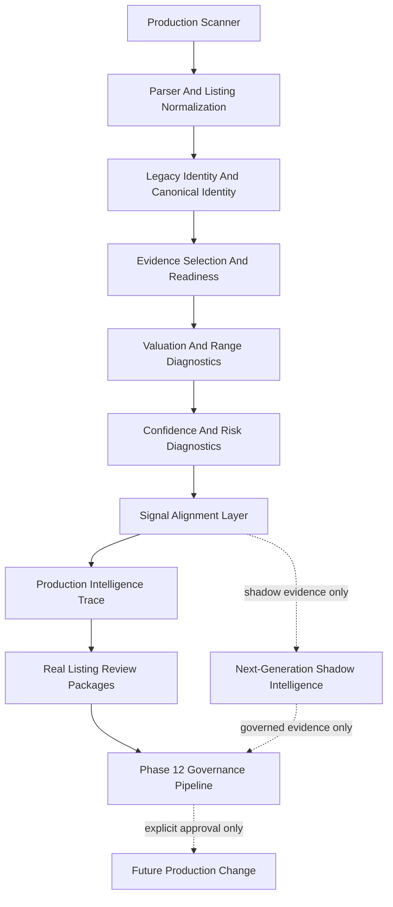
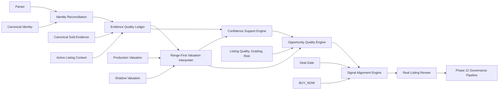

# Phase 13 Intelligence Roadmap

## Executive Summary

Phase 13 should move CardHawk from many useful intelligence signals toward a coherent next-generation intelligence architecture. The goal is to improve accurate, explainable detection of undervalued cards while preserving the production authority model and Phase 12 governance pipeline.

The current production system is stable enough to support capability development. The Phase 11 memory and serialization work reduced the major reliability blockers, and Phase 12 now provides an evidence chain for review, calibration, experimentation, shadow observation, proposal, approval, and deployment validation. Phase 13 should therefore focus on intelligence quality rather than more infrastructure-first reliability work.

The highest-value architectural problem is not speed or UI polish. It is signal alignment: parser, identity, evidence, valuation, confidence, quality, risk, ROI, and Deal Gate each produce valuable information, but the system still lacks a single governed intelligence layer that explains how these signals agree, conflict, and affect opportunity quality.

Recommended Phase 13 direction:

1. Preserve Deal Gate and BUY_NOW as the only production decision authority.
2. Introduce a next-generation intelligence orchestration layer in shadow or offline mode first.
3. Consolidate overlapping diagnostic interpretations into stable evidence contracts.
4. Improve identity, evidence, and valuation quality before changing any production thresholds.
5. Route every possible production change through the Phase 12 governance pipeline.

Recommended immediate next phase: Phase 13.0B - Intelligence Signal Inventory and Contract Alignment Audit.

## Current Architecture Assessment

### Scanner

The scanner is production-authoritative for discovering active marketplace listings and invoking scoring. It now has:

- scan overlap protection,
- bounded resident listing retention,
- scan-level universe snapshots,
- batched persistence for major learning stores,
- serialization instrumentation,
- memory stress validation patterns.

Assessment: mature enough to remain mostly unchanged during Phase 13. It should not be redesigned for intelligence work.

### Parser

The parser extracts listing-level card attributes from titles and marketplace metadata. It is still a critical source of uncertainty because active marketplace titles may be incomplete, promotional, wrong, misleading, or ambiguous.

Assessment: production-important, but should be improved only through diagnostics, review evidence, and governed changes. Phase 13 should treat parser output as evidence with uncertainty, not as truth.

### Identity

CardHawk currently has both legacy parsed identity and canonical identity infrastructure:

- `engines/legacyIdentityAdapter.js`
- `engines/canonicalIdentityEngine.js`
- `validation/identityParserDiagnostics.js`
- canonical identity fixtures and schemas

Assessment: strong foundation. The gap is not that identity does not exist, but that production scoring still needs a more unified interpretation of identity confidence, disagreement, and downstream impact.

### Canonical Sold Evidence

Canonical sold evidence has a disciplined offline architecture:

- provider governance,
- source research records,
- certification registry,
- manual verified acquisition workflow,
- canonical ingestion run repository,
- replay and summaries,
- dataset coverage reporting,
- controlled pilot planning.

Runtime canonical evidence support exists, but production authority remains correctly constrained. Active listings and aggregate values are not allowed to become true sold evidence.

Assessment: architecturally strong, intentionally incomplete because provider permission and transaction-level evidence remain gating constraints.

### Valuation

Valuation exists through production and shadow layers:

- `engines/marketValueEngine.js`
- `engines/valuationRangeEngine.js`
- `engines/shadowValuationEngine.js`
- `validation/rangeFirstValuationDiagnostics.js`
- canonical sold comparison services

Assessment: capable but split across point estimates, ranges, production fallback behavior, and shadow canonical valuation. Phase 13 should make range-first evidence interpretation easier to compare with production point estimates before changing formulas.

### Deal Gate

Deal Gate remains the production decision authority for BUY_NOW. It enforces sold evidence minimums, confidence minimums, ROI support, fallback valuation safeguards, and consistency rules.

Assessment: should remain unchanged during early Phase 13. It is the safety boundary, not the first optimization target.

### BUY_NOW

BUY_NOW is downstream of Deal Gate and should remain highly conservative. No shadow signal, diagnostic, AI output, recommendation, or calibration artifact should directly create BUY_NOW authority.

Assessment: mature as a protected production boundary.

### Governance Framework

Phase 12 delivered the complete governance chain:

```text
Production
-> Offline Review
-> Calibration Dataset
-> Recommendation
-> Offline Experiment
-> Shadow Experiment
-> Production Proposal
-> Explicit Dalton Approval
-> Code or Configuration Change
-> Deployment Validation
-> Deployment Consideration
```

Assessment: strong. Phase 13 should consume this pipeline rather than adding alternate approval paths.

## Architectural Strengths

- Production authority is explicit and conservative.
- Deal Gate and BUY_NOW are protected from shadow and offline systems.
- Canonical sold evidence has strong governance before production authority.
- Phase 11 substantially improved long-running production reliability.
- Phase 12 created a durable learning loop from real listings to reviewed evidence and governed proposals.
- Diagnostic modules are additive and preserve unknown values.
- Fingerprint and immutable artifact patterns are now consistent enough to support long-term auditability.
- Existing engines are modular enough to support a new orchestration layer without rewriting `server.js`.

## Architectural Weaknesses

- Intelligence outputs are distributed across many engines without one canonical signal alignment model.
- Some concepts are interpreted multiple times: evidence readiness, confidence, valuation support, listing quality, risk, grading quality, and false-positive risk.
- Production point valuation and shadow range valuation are not yet reconciled through a single durable comparison contract.
- Identity uncertainty is visible diagnostically but not yet coordinated across valuation, evidence selection, and false-positive review.
- Confidence is still partly a production score and partly an offline calibration target; the architecture needs clearer separation between reported confidence, supported confidence, and reviewed confidence.
- Canonical sold evidence remains limited by source permission and dataset depth.
- Learning engines record outcomes, but Phase 13 still needs a unified path from reviewed outcomes to production-safe intelligence proposals.
- Future AI assistance has not yet been placed into a strict evidence-only architecture.

## Components That Should Remain Unchanged

Early Phase 13 should not change:

- scan timing,
- marketplace request behavior,
- parser production behavior,
- production valuation formulas,
- Deal Gate rules,
- BUY_NOW criteria,
- notification criteria,
- persistence format,
- canonical sold evidence write paths,
- production confidence thresholds,
- provider qualification authority,
- shadow authority.

These boundaries keep accuracy work from becoming accidental production promotion.

## Recommended Intelligence Architecture

Phase 13 should introduce a layered architecture:



The key new architectural responsibility is the Signal Alignment Layer. It should not replace any engine. It should reconcile supplied outputs into a single explainable interpretation:

- which signals agree,
- which signals conflict,
- which missing evidence matters,
- which risk is decisive,
- whether valuation is supported,
- whether confidence is calibrated,
- whether a listing is likely a false positive,
- whether a rejected listing might be a missed opportunity.

The Signal Alignment Layer should begin shadow/offline only.

## Proposed Engine Catalog

### 1. Intelligence Signal Registry

Purpose: define canonical signal names, ownership, authority level, evidence policy, and display-safe semantics.

Architectural responsibility: prevent duplicate signal interpretation and preserve a stable language for downstream review.

Required inputs: existing engine outputs, diagnostic outputs, signal metadata.

Expected outputs: versioned signal definitions, authority metadata, evidence policy, supported values.

Production or offline: offline first, later production-readable metadata only.

Evidence or decision: evidence only.

Governance interaction: changes to signal authority or meaning require Phase 12 proposal and approval.

### 2. Signal Alignment Engine

Purpose: reconcile identity, evidence, valuation, confidence, risk, quality, grading, ROI, Deal Gate, BUY_NOW, and shadow diagnostics into one explainable agreement/conflict model.

Architectural responsibility: explain why CardHawk should trust, distrust, review, or ignore a candidate without changing the production decision.

Required inputs:

- production intelligence trace,
- identity parser diagnostics,
- evidence readiness diagnostics,
- range-first valuation diagnostics,
- confidence calibration diagnostics,
- listing quality and grading diagnostics,
- false-positive diagnostics,
- Deal Gate outcome,
- BUY_NOW eligibility.

Expected outputs:

- agreement summary,
- conflict summary,
- missing evidence summary,
- decisive risk summary,
- review priority,
- recommended governance action,
- deterministic fingerprint.

Production or offline: shadow/offline first.

Evidence or decision: evidence only.

Governance interaction: feeds review packages and calibration datasets.

### 3. Identity Confidence Reconciliation Engine

Purpose: unify parser completeness, canonical identity eligibility, disagreement risk, and comparable identity exactness.

Architectural responsibility: make identity uncertainty explicit before evidence selection or valuation interpretation.

Required inputs: parser output, canonical identity summary, identity diagnostics, comparable identity diagnostics.

Expected outputs:

- identity confidence posture,
- field-level conflict map,
- exact-comparison eligibility summary,
- identity-related valuation risk.

Production or offline: shadow first.

Evidence or decision: evidence only.

Governance interaction: supports review, calibration, and future parser proposals.

### 4. Evidence Quality Ledger

Purpose: create one canonical diagnostic interpretation of all evidence used or excluded.

Architectural responsibility: separate true sold evidence, active context, fallback evidence, stale evidence, duplicates, and rejected comps.

Required inputs:

- canonical sold evidence,
- active listing comps,
- comp engine output,
- comparable quality output,
- sold evidence service summaries,
- evidence readiness diagnostics.

Expected outputs:

- eligible evidence ledger,
- excluded evidence ledger,
- evidence depth classification,
- source concentration,
- stale/duplicate/ineligible reasons,
- readiness fingerprint.

Production or offline: shadow/offline first.

Evidence or decision: evidence only.

Governance interaction: supports calibration recommendations and provider/dataset priorities.

### 5. Range-First Valuation Interpreter

Purpose: make valuation uncertainty the default interpretation rather than treating point estimates as sufficient.

Architectural responsibility: compare point estimates, supported ranges, true sold depth, spread, recency, outliers, and source concentration.

Required inputs: production valuation, valuation range engine, shadow valuation, evidence quality ledger.

Expected outputs:

- supported range,
- point estimate posture,
- uncertainty level,
- valuation-withheld recommendation,
- confidence cap recommendation.

Production or offline: shadow first.

Evidence or decision: evidence only.

Governance interaction: future valuation changes require review, recommendation, experiment, shadow observation, proposal, approval, and deployment validation.

### 6. Confidence Support Engine

Purpose: separate reported confidence from evidence-supported confidence.

Architectural responsibility: compare confidence score against identity exactness, evidence depth, valuation uncertainty, quality risk, and reviewed outcomes.

Required inputs:

- production confidence,
- confidence calibration diagnostics,
- calibration datasets,
- dealer/Dalton review outcomes,
- false-positive and missed-opportunity metrics.

Expected outputs:

- confidence support level,
- overconfidence risk,
- underconfidence risk,
- recommended cap for experiments,
- review action.

Production or offline: offline first.

Evidence or decision: evidence only.

Governance interaction: outputs calibration recommendations only.

### 7. Opportunity Quality Engine

Purpose: evaluate whether a listing is a durable investment opportunity, not merely a high ROI calculation.

Architectural responsibility: combine margin of safety, liquidity, resale pressure, grading risk, demand quality, valuation support, and Deal Gate posture.

Required inputs:

- ROI,
- market value,
- valuation range,
- supply pressure,
- demand quality,
- grade premium,
- listing quality,
- risk,
- Deal Gate outcome.

Expected outputs:

- opportunity quality posture,
- fragility indicators,
- downside risk,
- exit confidence,
- review priority.

Production or offline: shadow first.

Evidence or decision: evidence only until governed promotion.

Governance interaction: supports false-positive reduction and missed-opportunity review.

### 8. Missed Opportunity Analyzer

Purpose: identify listings rejected by production that later evidence or Dalton review suggests should have been considered.

Architectural responsibility: measure false negatives without weakening Deal Gate.

Required inputs:

- rejected production decisions,
- review records,
- calibration datasets,
- later sold/resale outcomes when available,
- shadow diagnostics.

Expected outputs:

- missed-opportunity candidates,
- rejected-for-good-reason summary,
- blocked-by-evidence summary,
- proposal candidates for future experiments.

Production or offline: offline.

Evidence or decision: evidence only.

Governance interaction: feeds calibration recommendations.

### 9. False Positive Root Cause Analyzer

Purpose: classify why supported or BUY_NOW candidates may be unsafe.

Architectural responsibility: convert false-positive diagnostics and human review into root-cause categories.

Required inputs:

- production decision trace,
- false-positive diagnostics,
- listing quality diagnostics,
- identity diagnostics,
- evidence readiness,
- review outcomes.

Expected outputs:

- root-cause category,
- repeated failure pattern,
- affected subsystem,
- proposed review target.

Production or offline: offline.

Evidence or decision: evidence only.

Governance interaction: feeds recommendations and offline experiments.

### 10. Resale Outcome Intelligence

Purpose: connect purchase, hold, relist, sale, net proceeds, and realized profit back to original decision quality.

Architectural responsibility: close the loop between theoretical opportunity and realized business outcome.

Required inputs:

- purchase records,
- listing acquisition price,
- resale listing data,
- final sale price,
- fees,
- shipping,
- time-to-sell,
- original decision trace.

Expected outputs:

- realized ROI,
- pricing error,
- time-to-exit,
- decision accuracy,
- confidence calibration evidence.

Production or offline: offline first.

Evidence or decision: evidence only.

Governance interaction: strengthens calibration datasets and proposal evidence.

### 11. Provider Evidence Priority Engine

Purpose: use dataset coverage gaps to prioritize source research and manual acquisition.

Architectural responsibility: identify which identities, categories, grades, and price bands need better sold evidence.

Required inputs:

- canonical dataset operations reports,
- provider evaluation,
- source dossiers,
- research packets.

Expected outputs:

- acquisition priorities,
- provider questions,
- dataset gap report,
- evidence readiness blockers.

Production or offline: offline.

Evidence or decision: evidence only.

Governance interaction: supports Phase 9 provider governance and Phase 8 dataset growth.

### 12. Advisory AI Review Assistant

Purpose: help summarize evidence, suggest review focus, and detect possible inconsistencies in offline artifacts.

Architectural responsibility: assist Dalton, not decide for Dalton.

Required inputs:

- immutable review packages,
- governance validation reports,
- calibration datasets,
- proposal evidence.

Expected outputs:

- natural language summaries,
- possible inconsistency flags,
- review questions,
- evidence gap explanations.

Production or offline: offline only until separately approved.

Evidence or decision: advisory evidence only.

Governance interaction: any AI-produced recommendation must remain non-authoritative and must be preserved as an evidence artifact before it can influence a proposal.

## Dependency Diagram



## Multi-Phase Implementation Roadmap

### Phase Group 13.0 - Intelligence Contract Alignment

Milestone: align all current production, shadow, and diagnostic signals into a single inventory and authority map.

Dependencies:

- current engine outputs,
- production intelligence trace,
- Phase 12 governance pipeline validator.

Risks:

- over-consolidating too early,
- accidentally changing display or decision language,
- mixing evidence signals with production authority.

Expected architectural impact:

- clearer ownership,
- reduced duplicate interpretations,
- safer future engine work.

Implementation order:

1. Phase 13.0B - Intelligence Signal Inventory and Contract Alignment Audit.
2. Phase 13.0C - Intelligence Signal Registry Contract.
3. Phase 13.0D - Signal Authority Consistency Tests.

### Phase Group 13.1 - Identity And Evidence Alignment

Milestone: make identity and evidence readiness the first-class foundation for all future opportunity intelligence.

Dependencies:

- canonical identity engine,
- identity parser diagnostics,
- canonical sold comparison,
- evidence readiness diagnostics,
- comparable quality engine.

Risks:

- treating active context as sold evidence,
- over-weighting title-only identity inference,
- weakening exact identity requirements.

Expected architectural impact:

- fewer false positives from identity mismatches,
- clearer reason codes for missing evidence,
- stronger review package quality.

Implementation order:

1. Identity Confidence Reconciliation Contract.
2. Evidence Quality Ledger Contract.
3. Offline fixtures and review package integration.

### Phase Group 13.2 - Valuation And Confidence Interpretation

Milestone: make range-first valuation and confidence support central to shadow analysis.

Dependencies:

- market value engine,
- valuation range engine,
- shadow valuation engine,
- confidence calibration diagnostics,
- calibration datasets.

Risks:

- creating conflicting valuation narratives,
- implying production value changes before governance approval,
- hiding missing true sold evidence behind confidence language.

Expected architectural impact:

- better explainability,
- better overconfidence detection,
- stronger offline experiment candidates.

Implementation order:

1. Range-First Valuation Interpreter.
2. Confidence Support Engine.
3. Calibration recommendation integration.

### Phase Group 13.3 - Opportunity Quality And Error Analysis

Milestone: classify why listings are strong, fragile, false positive, or missed opportunity candidates.

Dependencies:

- ROI,
- risk,
- quality,
- grading,
- grade premium,
- supply pressure,
- demand quality,
- review outcomes.

Risks:

- producing buy-like language outside Deal Gate,
- confusing review priority with production recommendation,
- making opportunity quality too broad to validate.

Expected architectural impact:

- improved false-positive reduction,
- better missed-opportunity discovery,
- more focused Dalton review.

Implementation order:

1. Opportunity Quality Engine Contract.
2. False Positive Root Cause Analyzer.
3. Missed Opportunity Analyzer.

### Phase Group 13.4 - Closed-Loop Business Outcome Intelligence

Milestone: connect real purchase and resale results back to original decision quality.

Dependencies:

- purchase tracking,
- resale tracking,
- realized fee/cost models,
- original production traces,
- review and calibration datasets.

Risks:

- incomplete resale outcome data,
- confusing realized outcome variance with bad decision logic,
- premature production calibration from small samples.

Expected architectural impact:

- long-term accuracy improvement,
- better confidence calibration,
- stronger business-focused validation.

Implementation order:

1. Resale Outcome Record Contract.
2. Resale Outcome Dataset Builder.
3. Decision Outcome Attribution Report.

### Phase Group 13.5 - Governed Shadow Promotion Candidates

Milestone: convert successful intelligence experiments into Phase 12-compliant production proposals.

Dependencies:

- governance pipeline validator,
- calibration recommendation builder,
- offline experiment runner,
- shadow experiment runner,
- production proposal builder.

Risks:

- bypassing Dalton approval,
- treating shadow wins as production authority,
- proposing changes without enough real listing review evidence.

Expected architectural impact:

- safer production evolution,
- explicit audit trail,
- narrow and reversible changes.

Implementation order:

1. Governance Pipeline Report.
2. Intelligence Experiment Readiness Report.
3. Production Proposal Candidate Packager.

### Phase Group 13.6 - Advisory AI Assistance

Milestone: introduce AI only as a review assistant over immutable artifacts.

Dependencies:

- governance artifact registry,
- review packages,
- calibration datasets,
- pipeline validator output.

Risks:

- hallucinated evidence,
- implicit authority,
- untracked prompt or model drift,
- summaries that obscure missing data.

Expected architectural impact:

- faster review,
- better evidence summaries,
- improved operator focus.

Implementation order:

1. Advisory AI Evidence Summary Contract.
2. AI Review Prompt and Output Fingerprint Contract.
3. Human Review Confirmation Workflow.

## Long-Term Vision

CardHawk's long-term intelligence system should behave like an evidence-first investment analyst:

- It identifies the card precisely or explains why it cannot.
- It separates true sold evidence from active context and fallback assumptions.
- It treats valuation as a supported range, not just a point estimate.
- It calibrates confidence against reviewed outcomes.
- It explains Deal Gate and BUY_NOW decisions without weakening them.
- It learns from Dalton review and realized resale outcomes.
- It proposes changes only through governed, reversible, fingerprinted artifacts.

The production system should stay conservative while shadow and offline systems become increasingly sophisticated.

## Explicit Non-Goals

Phase 13 should not:

- rewrite `server.js`,
- change scanner cadence,
- change marketplace requests,
- weaken Deal Gate,
- change BUY_NOW criteria,
- change valuation formulas without governance,
- treat active listings as sold evidence,
- grant authority to shadow systems,
- grant authority to AI outputs,
- bypass provider licensing requirements,
- introduce production marketplace expansion,
- prioritize UI polish above accuracy, reliability, scalability, and explainability.

## Recommended Phase 13.0B

Phase 13.0B should be an Intelligence Signal Inventory and Contract Alignment Audit.

Purpose:

- inventory every production, shadow, diagnostic, and offline intelligence signal,
- identify each signal owner,
- classify authority as production, shadow, offline, diagnostic, or advisory,
- map duplicate concepts,
- identify conflicting names or semantics,
- define the minimum signal registry contract needed before new intelligence engines are added.

Deliverables:

- no code changes,
- signal inventory table,
- duplicate and overlap report,
- recommended signal registry schema,
- implementation plan for Phase 13.0C.

This is the safest next step because it improves architecture before adding new intelligence behavior.
