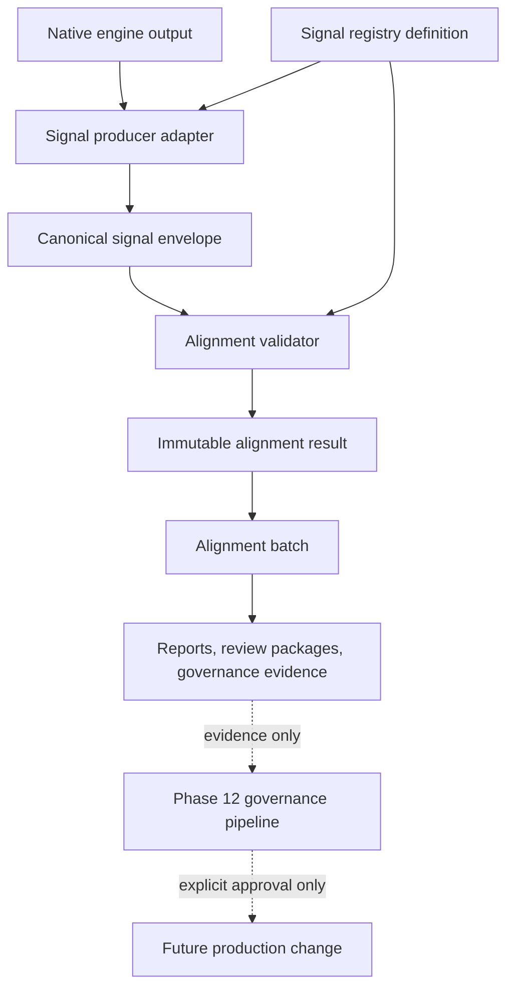

# Signal Alignment Engine Architecture

## Executive Summary

The Signal Alignment Engine is the permanent Phase 13 architecture for wrapping existing CardHawk intelligence outputs in the Canonical Intelligence Signal Contract and validating them against the Intelligence Signal Registry.

The engine is initially offline-only and observation-only. It does not execute native engines, recompute outputs, select winners, change valuation, change confidence, alter Deal Gate, alter BUY_NOW, send notifications, write persistence, or grant production authority. Its job is to preserve native outputs, add canonical metadata, resolve registry definitions, identify agreement or conflict, and produce immutable alignment evidence for review and governance.

The safest first migration target is the Phase 10 diagnostic signal family, beginning with identity parser diagnostics and evidence readiness diagnostics. These outputs are already shadow/offline, deterministic, structured, fingerprinted, and explicitly non-authoritative.

## Purpose

CardHawk now has many useful intelligence signals, but those signals are produced in different native shapes. The Signal Alignment Engine gives CardHawk a governed way to answer:

- Which native output produced this signal?
- Which registry definition describes it?
- Is the producer/version expected?
- What does its confidence mean?
- What evidence role does it play?
- Does it support or conflict with other signals?
- Does it preserve the production authority boundary?
- Can downstream review and governance systems trace it deterministically?

The engine aligns supplied outputs. It does not create intelligence by itself.

## Scope

In scope:

- accepting already-generated native outputs,
- resolving signal definitions from an immutable registry,
- wrapping native outputs in canonical signal envelopes,
- validating canonical signal and registry compatibility,
- preserving unknown values,
- describing confidence and evidence alignment,
- identifying missing definitions and version mismatches,
- summarizing supporting and conflicting signal relationships,
- building deterministic alignment fingerprints,
- producing immutable alignment results and batches.

Out of scope:

- executing native intelligence engines,
- recomputing parser, identity, valuation, confidence, risk, quality, or grading results,
- changing production score fields,
- changing Deal Gate or BUY_NOW,
- changing notification behavior,
- changing persistence,
- changing scanner flow,
- granting authority to shadow or offline systems.

## Data Flow

The core boundary is between native output and canonical envelope. Native output remains intact in `rawOutput`; the alignment engine adds metadata around it.

## Inputs

The alignment engine should accept:

- native output object,
- source producer identity,
- source producer version,
- producer category,
- signal name,
- requested signal version,
- source output fingerprint,
- optional created timestamp,
- optional normalized output supplied by a producer adapter,
- optional confidence and uncertainty metadata,
- optional evidence basis and evidence quality metadata,
- optional supporting and conflicting signal references,
- immutable Intelligence Signal Registry.

Inputs may come from production traces, offline diagnostics, shadow diagnostics, review packages, test fixtures, or governance artifacts. Inputs must already exist; the engine must not call producers to obtain them.

## Outputs

Primary output: immutable alignment result.

Secondary outputs:

- alignment batch,
- relationship summaries,
- validation summaries,
- reporting projections.

The output is advisory evidence only. It must be safe for review packages, calibration datasets, governance reports, and future shadow experiments.

## Native Output Preservation

Native outputs are preserved under `canonicalSignal.rawOutput`.

Rules:

- Do not mutate native output.
- Do not drop falsy values such as `0`, `false`, or empty strings when they are part of native output.
- Do not normalize native output in place.
- Do not infer missing fields.
- Do not convert warnings into blockers unless the native output or adapter supplies that meaning.
- Do not convert advisory fields into production decisions.

Producer adapters may supply `normalizedOutput`, but normalized output is an additive projection. It cannot replace `rawOutput`.

## Canonical Wrapping Flow

1. Receive a native output and producer metadata.
2. Compute or accept `sourceOutputFingerprint`.
3. Resolve the signal definition from the registry by `signalName` and `signalVersion`.
4. If a definition exists, compare producer, producer version, category, signal type, decision role, authority level, expected output fields, confidence semantics, evidence requirements, and authority boundaries.
5. Build a Canonical Intelligence Signal envelope with native output in `rawOutput`.
6. Validate the canonical signal using the Phase 13.0C contract.
7. Build confidence, evidence, authority, and relationship alignment summaries.
8. Produce an immutable alignment result with deterministic status and fingerprint.

## Registry Interaction

Registry lookup is exact by signal name and signal version.

Version resolution rules:

- Exact name and version match: eligible for `aligned`.
- Name exists but version differs: `version_mismatch`.
- Name does not exist: `definition_missing`.
- Definition is deprecated or superseded: eligible only for `aligned_with_warnings` unless the requested version explicitly targets historical review.
- Circular or invalid supersession in the registry: `invalid`.

The engine must not invent registry definitions. Missing definitions remain missing.

## Producer Adapter Model

Producer adapters are small offline mapping functions. They translate a known native output family into canonical signal input metadata.

Adapter responsibilities:

- identify producer and version,
- choose canonical signal name and version,
- preserve native output,
- supply optional normalized output,
- map known warning and blocker fields,
- map confidence and uncertainty only when already present,
- map evidence references only when already supplied or explicitly derivable from immutable input references,
- declare source fingerprint.

Adapter non-goals:

- no engine execution,
- no formula recomputation,
- no evidence inference,
- no production decision interpretation,
- no persistence writes.

Adapters should be small and signal-family specific. They should not become a second implementation of native engine business logic.

## Alignment Result Schema

An immutable alignment result should contain:

- `schemaVersion`
- `alignmentId`
- `createdAt`
- `sourceProducer`
- `sourceProducerVersion`
- `sourceProducerCategory`
- `sourceSignalName`
- `requestedSignalVersion`
- `sourceOutputFingerprint`
- `registryId`
- `registryVersion`
- `registryFingerprint`
- `matchedSignalDefinition`
- `canonicalSignal`
- `alignmentStatus`
- `alignmentWarnings`
- `alignmentErrors`
- `missingMetadata`
- `confidenceAlignment`
- `evidenceAlignment`
- `authorityAlignment`
- `relationshipSummary`
- `productionImpact: "none"`
- `decisionImpact: "none"`
- `executionAuthority: "none"`
- `alignmentFingerprint`

`matchedSignalDefinition` should be a cloned immutable registry definition or `unknown` when missing. The `canonicalSignal` should be a cloned immutable canonical signal or `unknown` when no safe wrapper can be built.

## Statuses

Alignment statuses are deterministic:

- `aligned`: definition matched, canonical signal validates, and no material warnings exist.
- `aligned_with_warnings`: usable alignment with non-blocking warnings, deprecated definitions, missing optional metadata, or non-critical semantic gaps.
- `incomplete`: required native metadata is missing, but the issue is not an invalid contract violation.
- `definition_missing`: no registry definition exists for the requested signal name and version.
- `version_mismatch`: signal name exists, but requested version does not match a registered definition.
- `invalid`: canonical signal validation, registry validation, fingerprint validation, or schema validation failed.
- `blocked`: authority boundary, evidence boundary, or required metadata violation prevents safe alignment.

Status precedence should be:

1. `blocked`
2. `invalid`
3. `definition_missing`
4. `version_mismatch`
5. `incomplete`
6. `aligned_with_warnings`
7. `aligned`

## Confidence Alignment

Confidence alignment compares supplied signal confidence metadata with registry confidence semantics.

It should report:

- confidence kind,
- confidence value and scale,
- confidence level,
- whether confidence is calibrated, reported, reviewed, derived, unknown, or not applicable,
- registry confidence semantics matched or missing,
- confidence warnings,
- confidence blockers.

Rules:

- Do not recompute confidence.
- Do not infer confidence from status, score, ROI, risk, or Deal Gate.
- Missing confidence remains `unknown`.
- Unsupported confidence scale is a warning or blocker depending on the registry definition.
- Confidence alignment cannot change production confidence thresholds.

## Evidence Alignment

Evidence alignment compares the canonical signal evidence basis and evidence references with registry evidence requirements.

It should report:

- evidence role,
- expected evidence basis,
- supplied evidence basis,
- evidence references present or missing,
- true sold evidence count,
- active listing context count,
- fallback evidence count,
- stale, rejected, duplicate, and transaction-ineligible evidence counts when supplied,
- source fingerprint references,
- evidence warnings,
- evidence blockers.

Rules:

- Active listings and fallback values never satisfy true sold minimums.
- Missing evidence remains missing.
- Registry evidence requirements describe expectations; they do not create evidence.
- Evidence alignment cannot promote canonical sold evidence authority.

## Authority Alignment

Authority alignment is mandatory for every result.

It should verify:

- canonical signal `productionImpact` is `none`,
- canonical signal `decisionImpact` is `none`,
- canonical signal `executionAuthority` is `none`,
- registry definition preserves the same boundary,
- governance flags do not grant production, marketplace, ingestion, notification, or store-write authority,
- native output is not being used to create new production authority.

Any authority violation should produce `blocked`.

## Duplicate Signal Handling

Duplicate detection should be deterministic within an alignment batch.

Duplicates are defined by:

- same `signalName`,
- same `signalVersion`,
- same `producer`,
- same `producerVersion`,
- same `sourceOutputFingerprint`.

Duplicate policy:

- exact duplicates may be collapsed in reporting but should remain traceable if supplied as separate inputs;
- duplicates with different fingerprints are distinct observations;
- duplicate definitions in the registry are invalid;
- duplicate canonical signals with conflicting native outputs should produce conflict metadata, not overwrite each other.

## Conflicting Signal Handling

The engine should distinguish:

- native conflicts supplied by producers,
- registry semantic conflicts,
- cross-signal conflicts detected by alignment rules,
- evidence conflicts,
- confidence conflicts,
- authority conflicts.

The initial implementation should detect only explicit conflicts supplied by canonical signal inputs and simple metadata conflicts, such as:

- production confidence says high while calibration diagnostic says overconfident,
- valuation support says supported while evidence readiness says insufficient,
- identity diagnostic says blocked while valuation signal claims exact identity support.

The engine should report conflicts; it must not resolve them into production decisions.

## Supporting Signal Relationships

Supporting relationships should be represented as signal references, not copied full signal payloads.

Each relationship should include:

- source signal ID,
- source signal fingerprint,
- relationship type,
- relationship reason,
- optional details.

Relationship summaries should count supporting, conflicting, missing, and unresolved references. Missing referenced signals should be warnings unless a registry definition marks the relationship as required.

## Batch Alignment Behavior

An alignment batch groups multiple alignment results for one listing, review package, trace, workspace, experiment, or governance artifact.

Batch schema should include:

- `schemaVersion`
- `alignmentBatchId`
- `createdAt`
- `sourceArtifactId`
- `sourceArtifactFingerprint`
- `registryId`
- `registryFingerprint`
- `resultCount`
- `results`
- `statusSummary`
- `producerSummary`
- `signalTypeSummary`
- `authoritySummary`
- `warningSummary`
- `errorSummary`
- `relationshipSummary`
- `productionImpact: "none"`
- `decisionImpact: "none"`
- `executionAuthority: "none"`
- `alignmentBatchFingerprint`

Results should sort deterministically by signal name, version, producer, and source output fingerprint.

## Determinism and Fingerprinting

Fingerprints should use existing stable fingerprint helpers and exclude their own fingerprint fields.

Required fingerprints:

- source output fingerprint,
- canonical signal fingerprint,
- registry fingerprint,
- alignment result fingerprint,
- alignment batch fingerprint.

Deterministic ordering is required for:

- batch inputs,
- alignment results,
- warnings,
- errors,
- missing metadata,
- relationship references,
- summary keys.

## Validation Model

Validation should be layered:

1. Validate registry.
2. Validate requested definition lookup.
3. Validate native-output presence and source fingerprint.
4. Validate canonical signal envelope.
5. Validate authority boundary.
6. Validate confidence semantics.
7. Validate evidence requirements.
8. Validate relationships.
9. Validate deterministic fingerprint.

Validation output should include:

- `valid`
- `status`
- `errors`
- `warnings`
- `reasonCodes`
- `missingMetadata`
- `definitionViolations`
- `versionViolations`
- `canonicalSignalViolations`
- `confidenceViolations`
- `evidenceViolations`
- `authorityViolations`
- `relationshipViolations`
- `fingerprintViolations`

## Offline and Shadow Boundaries

Initial execution modes:

- offline review alignment,
- offline fixture alignment,
- offline calibration dataset alignment,
- shadow report alignment from already captured traces.

Not allowed:

- automatic scan integration,
- server route integration,
- scoring pipeline integration,
- persistence writes,
- notification integration,
- production authority,
- runtime threshold changes.

Future shadow integration may consume already generated production traces and diagnostics. It should remain observation-only until the Phase 12 governance pipeline explicitly approves a production proposal.

## Governance Integration

The Signal Alignment Engine should feed:

- Real Listing Decision Review packages,
- Dalton Review Workspaces,
- Calibration Datasets,
- Calibration Recommendations,
- Offline Experiments,
- Shadow Experiments,
- Production Proposals,
- Governance Pipeline Validator.

It should not bypass any governance phase. Aligned signals become evidence, not approval.

## Future Module Boundaries

Recommended future modules:

### `validation/signalAlignmentEngine.js`

Builds one immutable alignment result from supplied native output, producer metadata, and registry definition.

### `validation/signalProducerAdapter.js`

Provides small producer-specific adapter helpers for known output families. Adapters preserve native output and supply canonical metadata.

### `validation/signalAlignmentValidator.js`

Validates alignment results and batches without rebuilding them.

### `validation/signalAlignmentBatch.js`

Builds deterministic alignment batches and aggregate summaries.

### `validation/signalConflictAnalyzer.js`

Analyzes explicit supporting and conflicting signal relationships across a batch.

### `validation/signalAlignmentReport.js`

Produces human-readable offline reports for review and governance.

## Implementation Order

Recommended sequence:

1. Implement `signalAlignmentEngine` contract and result builder.
2. Implement registry lookup and exact version validation.
3. Implement canonical signal wrapping for supplied native output.
4. Implement alignment result validation and fingerprints.
5. Implement one producer adapter for identity parser diagnostics.
6. Implement one producer adapter for evidence readiness diagnostics.
7. Implement batch alignment and summaries.
8. Implement conflict analyzer for explicit supplied conflicts only.
9. Implement offline report generator.
10. Add optional consumption by review package tooling in a later phase, still offline-only.

## First Signal Family for Migration

Recommended first signal family: Phase 10 diagnostics, starting with:

1. `identityParserDiagnostics`
2. `evidenceReadinessDiagnostics`

Why this is safest:

- already offline/shadow diagnostic,
- deterministic,
- structured and fingerprinted,
- no production authority,
- directly useful for review packages,
- low risk of changing production behavior,
- strong coverage in existing tests.

The first production-context family should wait until the offline diagnostic family is proven. When ready, the next candidate would be display/read-only annotations from existing signal semantics, not valuation formulas or Deal Gate.

## Production Migration Strategy

Migration must remain wrapper-first:

1. Align offline diagnostic outputs.
2. Add alignment outputs to offline reports.
3. Allow review packages to include optional aligned signal evidence.
4. Build calibration datasets from aligned evidence.
5. Evaluate any signal interpretation changes through recommendations and offline experiments.
6. Run successful ideas in shadow experiments.
7. Create production proposals only after shadow evidence exists.
8. Require explicit Dalton approval.
9. Implement any approved code or configuration change separately.
10. Validate and monitor after deployment.

No aligned signal may become production-authoritative by construction.

## Explicit Non-Goals

- No code implementation in Phase 13.0E.
- No production runtime integration.
- No native engine execution.
- No native output mutation.
- No parser changes.
- No identity changes.
- No valuation changes.
- No confidence changes.
- No Deal Gate changes.
- No BUY_NOW changes.
- No notification changes.
- No persistence changes.
- No marketplace behavior changes.
- No automatic production proposal.
- No automatic approval.

## Recommended Next Implementation Phase

Recommended next phase: Phase 13.0F - Signal Alignment Engine Contract.

Phase 13.0F should implement the immutable offline-only alignment result contract and validation helpers. It should not yet implement producer adapters for every engine. The first implementation should prove:

- exact registry definition lookup,
- canonical signal wrapper construction from supplied native output,
- authority-boundary enforcement,
- deterministic alignment fingerprints,
- missing-definition and version-mismatch statuses,
- immutable result behavior,
- no production imports.
